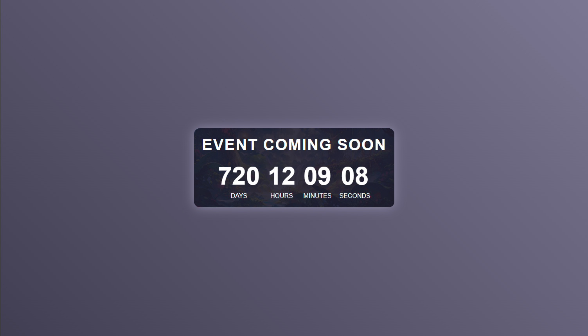

# Event Countdown Page

A visually appealing "Coming Soon" countdown page designed for an upcoming event, featuring an animated gradient background and responsive design. 

## 🖼️ Features

- **Dynamic Countdown Timer**: Automatically calculates and displays the remaining days, hours, minutes, and seconds until the event.
- **Animated Background**: A gradient animation for an engaging visual effect.
- **Responsive Design**: Fully responsive layout for optimal viewing on desktops, tablets, and mobile devices.
- **CSS Glow Effect**: Adds a subtle glowing effect to enhance visual appeal.
- **Overlay on Background**: Semi-transparent overlay for better readability of content.

## 🛠️ Technologies Used

- **HTML**: For the page structure.
- **CSS**: For styling and animations.
- **JavaScript**: For dynamic countdown functionality.

# 📅 Countdown Date
The countdown is set to target January 15, 2025, at 12:00 PM. You can update the target date in the JavaScript code inside the <script> tag:
`const targetDate = new Date("2027-01-15T12:00:00").getTime();`

## 🖼️ Screenshots

